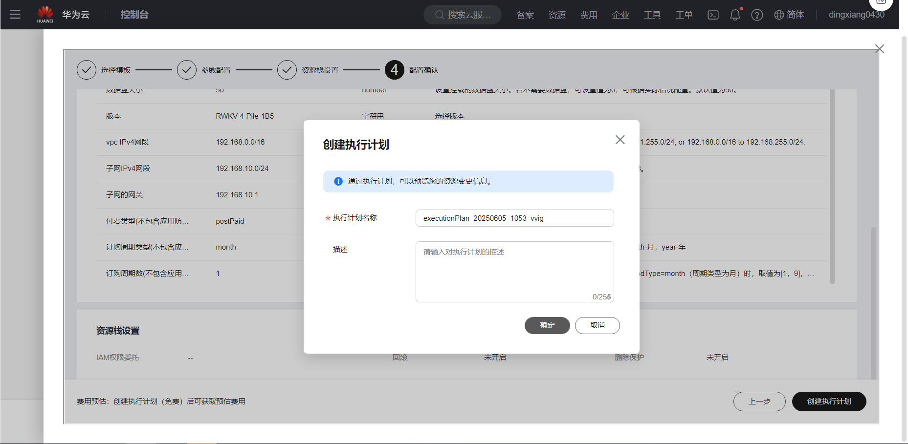
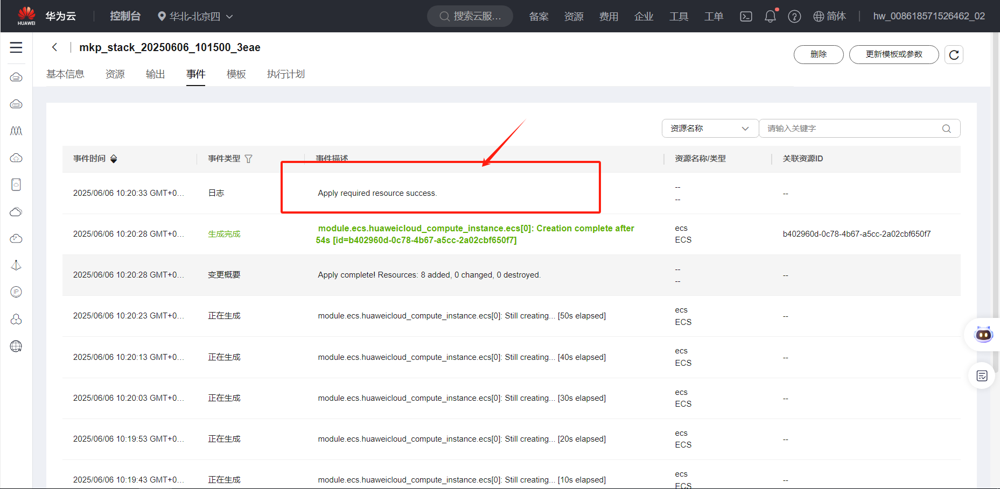
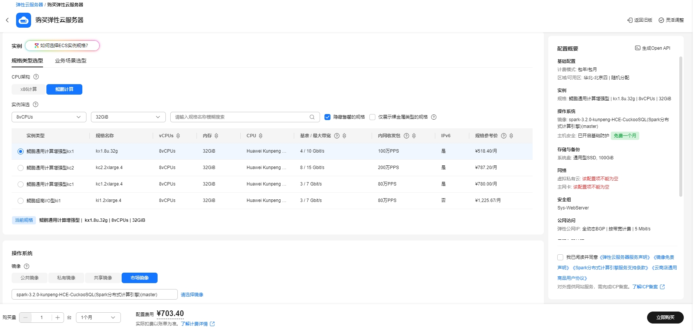
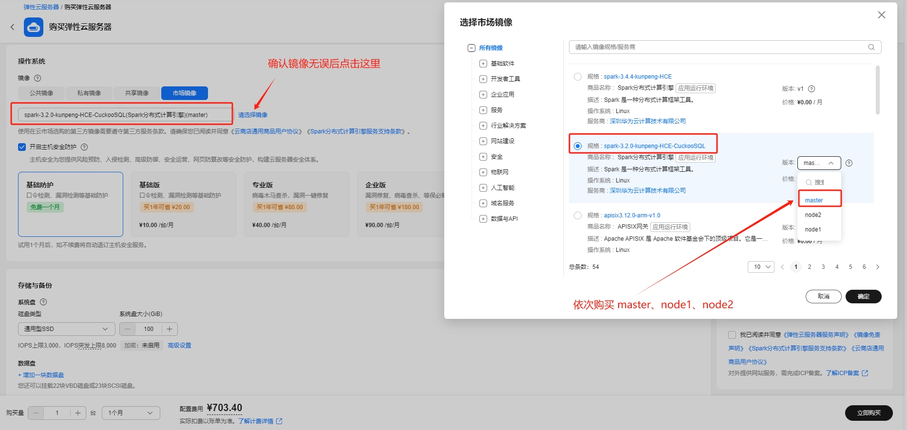
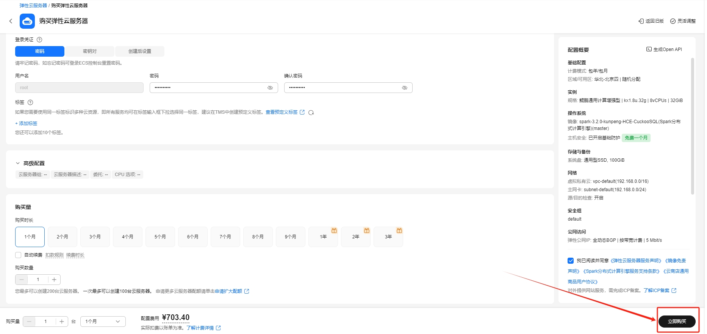
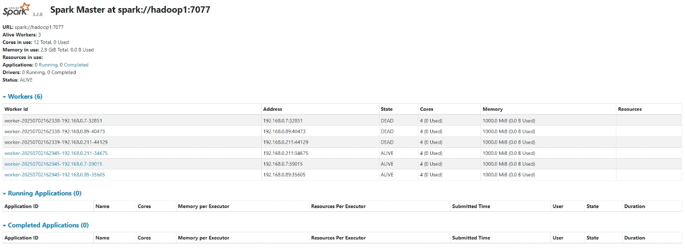
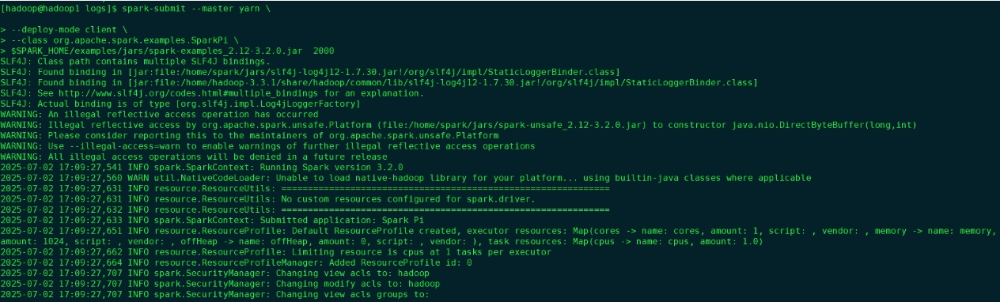
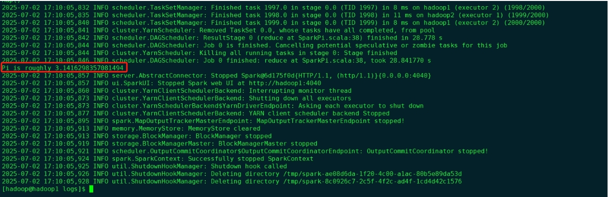

# Spark分布式计算引擎使用指南

# 一、商品链接

[Spark分布式计算引擎](https://marketplace.huaweicloud.com/hidden/contents/f64209ef-b251-4d92-b560-ff21acf86e09#productid=OFFI1126357985762062336)

# 二、商品说明

Apache Spark 是开源的分布式计算引擎，‌核心优势‌在于内存计算（比Hadoop快数十倍）和统一处理框架（批处理、流计算、机器学习等）。它通过弹性数据集（RDD）实现高效容错，支持多语言API，广泛应用于实时分析、大规模ETL、AI训练等场景，是当前大数据生态的核心组件之一。该产品基于鲲鹏服务器和华为云 EulerOS 2.0 64bit 系统，提供开箱即用的Spark。

# 三、商品购买
您可以在云商店搜索 **Spark分布式计算引擎**。

其中，地域、规格、推荐配置使用默认，购买方式根据您的需求选择按需/按月/按年，短期使用推荐按需，长期使用推荐按月/按年，确认配置后点击“立即购买”。


## 3.1 使用 RFS 模板直接部署
* 本方式购买可以一次性完成集群3台节点的购买。(一次可以买3台ECS节点)    


必填项填写后，点击 下一步


创建直接计划后，点击 确定


点击部署，执行计划

如下图“Apply required resource success. ”即为资源创建完成

## 3.2 ECS 控制台配置
* 本方式购买每次只能购买集群中的一个节点, 3台节点需要购买3次。(一次只买1台ECS节点)    

### 准备工作

在使用ECS控制台配置前，需要您提前配置好 **安全组规则**。    

> **安全组规则的配置如下：**
- 入方向规则放通端口8080,7077，源地址内必须包含您的客户端ip，否则无法访问
- 入方向规则放通 CloudShell 连接实例使用的端口 `22`，以便在控制台登录调试
- 出方向规则一键放通

### 创建ECS

前提工作准备好后，选择 ECS 控制台配置跳转到[购买ECS](https://support.huaweicloud.com/qs-ecs/ecs_01_0103.html) 页面，ECS 资源的配置如下图所示:    

选择CPU架构    
    
选择服务器规格    
    
选择镜像    
    
其他参数根据实际情况进行填写，填写完成之后，点击立即购买即可    
    


> **值得注意的是：**
> - VPC 您可以自行创建
> - 安全组选择 [**准备工作**](#准备工作) 中配置的安全组；
> - 弹性公网IP选择现在购买，推荐选择“按流量计费”，带宽大小可设置为5Mbit/s；
> - 高级配置需要在高级选项支持注入自定义数据，所以登录凭证不能选择“密码”，选择创建后设置；
> - 其余默认或按规则填写即可。

# 四、商品使用

## 启动Spark依赖组件(1、2、3、4)及Spark服务(5)
### 1. 更新机器名称和ip映射
```shell
vim /etc/hosts  
```

X.X.X.X hadoop1

X.X.X.X hadoop2

X.X.X.X hadoop3

X.X.X.X 修改成本机实际ip 如192.168.10.2

### 2. 重新生成免密登录,重置用户hadoop 密码例如:123456 ,建议采用符合密码复杂度的密码

2.1 删除旧密钥文件
```shell
su - hadoop    
cd ~/.ssh/  
rm -rf id_rsa id_rsa.pub known_hosts      
```

2.2 免密登录
```shell
su - hadoop  
ssh-keygen -t rsa  

ssh-copy-id -i ~/.ssh/id_rsa.pub hadoop1    -- hadoop 密码例如:123456      
ssh-copy-id -i ~/.ssh/id_rsa.pub hadoop2    -- hadoop 密码例如:123456        
ssh-copy-id -i ~/.ssh/id_rsa.pub hadoop3    -- hadoop 密码例如:123456  
```
注意:本机(hadoop1)也要执行!

### 3. 在hadoop家目录下($HADOOP_HOME)启动hadoop集群
```shell
cd /home/hadoop-3.3.1/sbin/ 
```
**以下服务的启动顺序需要按顺序执行！**

启动hdfs
```shell
./start-dfs.sh
```

启动yarn
```shell
./start-yarn.sh
```

启动历史服务(只执行一种即可)
```shell
mapred --daemon start historyserver  
mr-jobhistory-daemon.sh start historyserver  
```
注意:    
mapred --daemon start historyserver --优先    
mr-jobhistory-daemon.sh start historyserver -- 会提示已过时,次选

### 4. 启动Hive服务
```shell
nohup hive --service metastore &
nohup hive --service hiveserver2 &
```

**在其它节点Hive家目录($HIVE_HOME)下使用hadoop账户进行Hive远程登录:**
```shell
./bin/beeline -u jdbc:hive2://hadoop1:10000 -n hadoop
```


### 5. 启动Spark服务
```shell
cd $SPARK_HOME/sbin

./start-all.sh
```
至此 可以使用jps命令查看已启动的所有服务以作检查确认。  

注意:因系统已经配置完成了路径的映射关系（具体可查看 /etc/profile），以上3,4,5步骤的命令可以在任意路径下执行，但为保证命令的执行成功，建议在各组件的家目录下确认命令后执行(或者带上路径执行)，避免因部分组件的命令存在重复导致执行错误。例如$HADOOP_HOME/sbin 和$SPARK_HOME/sbin 都存在 start-all.sh 但是含义不同，注意甄别。 <br/>


## Spark使用
* Web查看 SparkUI  IP+8080访问UI



* 运行示例程序:
```shell
spark-submit --master yarn \
--deploy-mode client \
--class org.apache.spark.examples.SparkPi \
$SPARK_HOME/examples/jars/spark-examples_2.12-3.2.0.jar 2000
```





### 参考文档
[Spark官网](https://Spark.apache.org/) 
